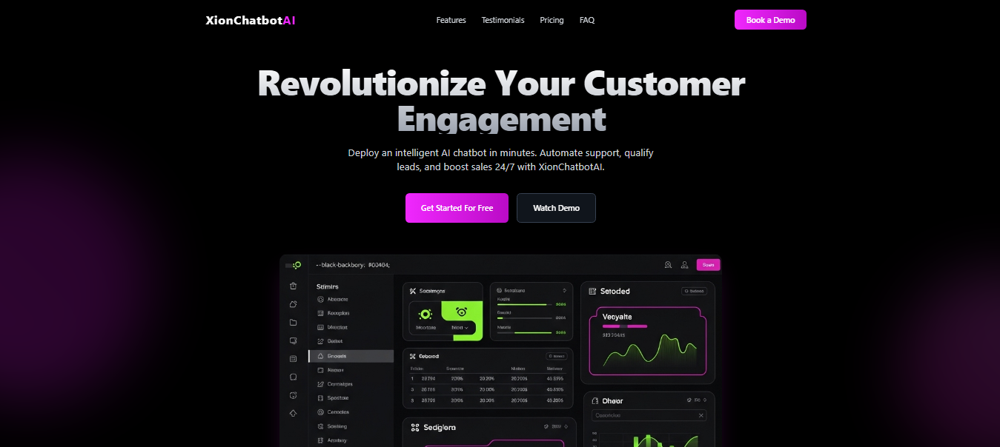

# 🤖 XionChatbots AI – SaaS Landing Page

## 📌 Descripción

XionChatbots AI es una landing page moderna y optimizada para un SaaS de chatbots impulsados por inteligencia artificial.
Desarrollada con React + TypeScript + TailwindCSS y creada con apoyo de Google AI Studio, esta web está enfocada en mostrar las características, planes de precios, testimonios y FAQ de un producto SaaS de manera clara y atractiva.

## 🚀 Características

🎨 UI moderna y minimalista estilo SaaS con dark theme.

⚡ React + TypeScript para escalabilidad y robustez.

📱 Responsive design (desktop, tablet y móvil).

🛠 TailwindCSS para personalización rápida y eficiente.

🧩 Secciones listas para SaaS:

Hero con CTA

Features

Pricing Plans

Testimonials

FAQ

Footer con enlaces legales y sociales

## 🛠 Tecnologías

React

TypeScript

TailwindCSS

Google AI Studio

## 📂 Instalación

Clona este repositorio e instala las dependencias:

git clone https://github.com/YoshuaSoto95/SaaS-Chatbot-Landing-Page-XionChatbotAI.git
cd xionchatbots-landing
npm install

# Ejecuta el proyecto en local:

npm run dev

🔗 Ver Proyecto en Vivo : https://xionchatbotai.netlify.app/

# 📷 Capturas

## 👨‍💻 Autor
[Dann Kloppering]
- GitHub: [Dann Kloppering](https://github.com/YoshuaSoto95?tab=repositories)
- LinkTree: [Dann Kloppering](https://dannkloppering-linktree.netlify.app/)